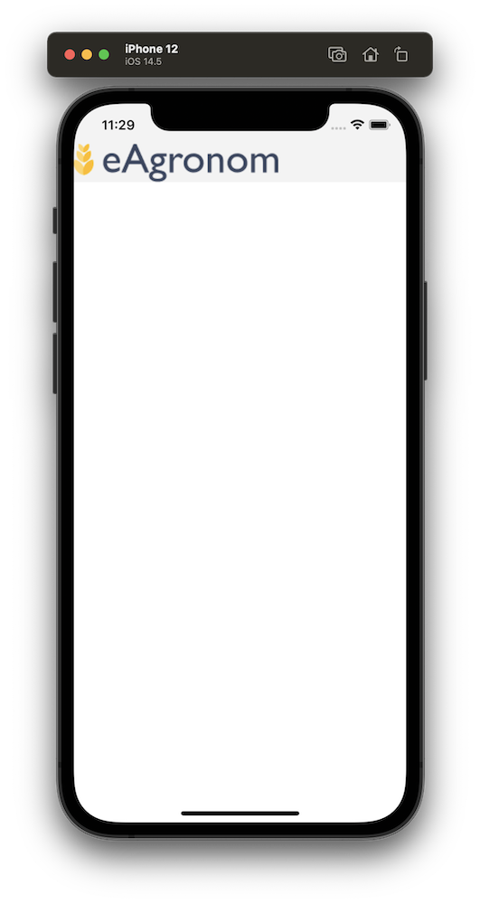

# Homework for mobile engineer

eAgronom

This is a simple set of tasks to give us an overview of your experience with React Native.

It should not take more than 2-3h of your time.

## Tasks

You should have received a Figma prototype link with the assigment.

### 1. Login screen

Implement the UI shown in the first (leftmost) prototype in Figma.

* tapping the login button clears the usename and password fields
* the eye icon in the password field represents Android built-in password visibility feature – no custom implementation necessary
* logo image is provided in the repository

### 2. Network state indicators

Implement a way to notify the user if the device drops connection.

* when the device is offline, a blue bar is displayed at the top of the screen, as seen on the second (middle) prototype in Figma
* when the device goes from offline to online, the blue bar is replaced with a green bar, as seen on the third (rightmost) prototype in Figma
* the green bar disappears 5 (five) seconds after it is shown... then the view reverts back to as shown in the first (leftmost) prototype
* if at any point in the green bar lifecycle device loses connectivity again, blue bar lifecycle takes precedence

The icon on the right hand side on the blue bar is from material icons called `info-outline`.

Feel free to use any method for checking connectivity, from querying hardware to pinging a server.
You can add a comment in the code explaining your reasoning for the chosen method.

## Prerequisites

Make sure that your system has the dependencies necessary to compile and run React Native CLI projects

### For Android

* Node 12+
* Watchman (if on macOS)
* Java 8
* Android SDK

### For iOS (on macOS)

* Node 12+
* Watchman
* Xcode
* Cocoapods

## Running the app

Run `yarn` to to install dependencies

### For Android

Run `yarn android`

### For iOS

Under the `ios` directory, run `pod install`

Run `yarn ios`

### Running tests

Run `yarn test` for all tests or `yarn test --watch` for interactive mode

## Starting state

You should see an app something like this (image taken from iOS Simulator).

